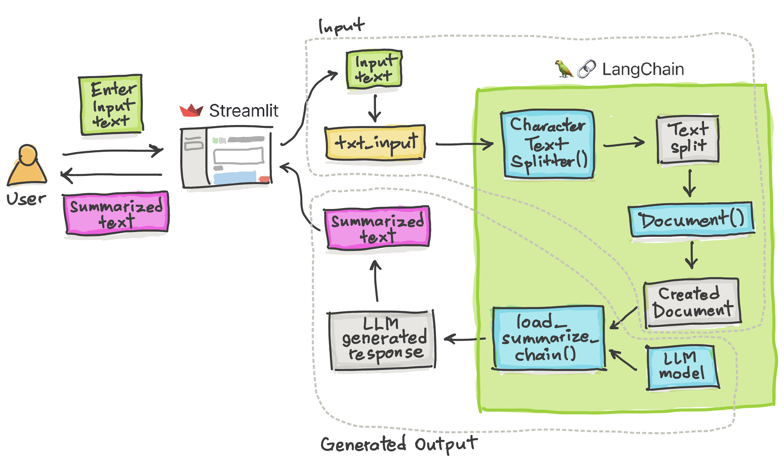

# 🦜🔗 Langchain - Text Summarization App
```
Text Summarization App built using Langchain and Streamlit
```

## Overview of the App



- Accepts a paragraph of text as the input text (to be summarized) using Streamlit's `st.text_input()`
- Text is split into chunks via `CharacterTextSplitter()` along with its `split_text()` method
- Document is generated via `Document()
- Text summarization is achieved using `load_summarize_chain()` by applying the `run()` method on the input `docs`.

## Demo App


## Get an OpenAI API key

You can get your own OpenAI API key by following the following instructions:
1. Go to https://platform.openai.com/account/api-keys.
2. Click on the `+ Create new secret key` button.
3. Next, enter an identifier name (optional) and click on the `Create secret key` button.

## Installation

To install the repository, please clone this repository and install the requirements:

```
pip install -r requirements.txt
```

You will also need to add your OpenAI API key to the `.env` file.

## Usage

To use the application, run the `main.py` file with the streamlit CLI (after having installed streamlit): 

```
streamlit run app.py
```
